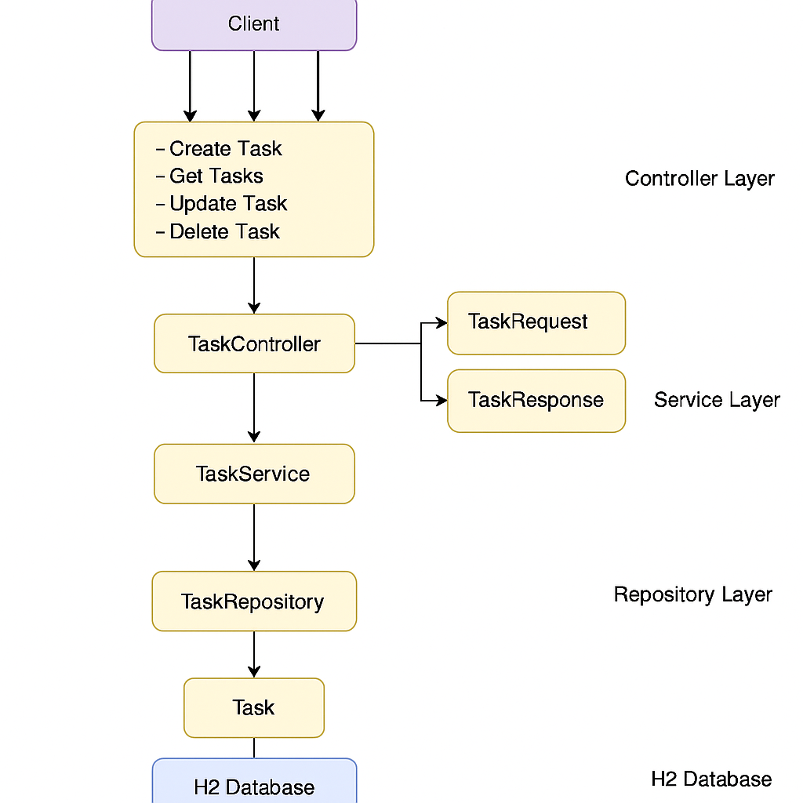

# 📋 Task Management Service

A simple Spring Boot application for managing tasks using REST APIs. It supports creating, retrieving, updating, and deleting tasks. The app uses an in-memory H2 database for quick development and testing.

---

## 🛠 Design Overview

- **Layered Architecture**:
  - **Controller Layer**: Handles HTTP requests and maps them to service methods.
  - **Service Layer**: Contains business logic and maps request/response DTOs.
  - **Repository Layer**: Manages persistence via Spring Data JPA.
  - **DTO Layer**: Used to abstract entity logic from incoming requests and outgoing responses.

- **H2 In-Memory Database**:
  - The app uses an embedded H2 database with zero configuration.
  - Data resets every time the application restarts.

- **Validation**:
  - Basic input validation using `javax.validation` annotations.

- **Lombok**:
  - Reduces boilerplate code with annotations like `@Builder`, `@Getter`, `@Setter`, etc.

- **Extensible Design**:
  - Easy to add features like pagination, filtering, authentication, or persistent databases.

---

## 🖼 Architecture Diagram



---

## 🚀 How to Run

### Prerequisites
- Java 17+
- Maven 3+

### Steps

1. **Clone the repository**

   ```bash
   git clone https://github.com/your-username/task-service.git
   cd task-service
   ```

2. **Run the application**

   ```bash
   mvn spring-boot:run
   ```

3. **Access the application**
  - REST API base URL: `http://localhost:8080/tasks`
  - H2 Console: `http://localhost:8080/h2-console`
    - JDBC URL: `jdbc:h2:mem:taskdb`
    - User: `sa`
    - Password: *(leave blank)*
  -Swagger URL: http://localhost:8080/swagger-ui/index.html#/task-controller

---

## ✅ Running Tests

To run tests:

```bash
mvn test
```

Test cases include:
- Service layer unit tests
- Controller layer integration tests (if implemented)

---

## 🧠 Assumptions

- The `Task` entity has the fields: `title`, `description`, and `dueDate`.
- No authentication or authorization is applied.
- Data is not persisted beyond application lifecycle (due to in-memory DB).
- The request model is validated for required fields only.

---

## 📂 REST API Endpoints

| Method | Endpoint         | Description             |
|--------|------------------|-------------------------|
| POST   | `/tasks`         | Create a new task       |
| GET    | `/tasks`         | Get all tasks           |
| GET    | `/tasks/{id}`    | Get task by ID          |
| PUT    | `/tasks/{id}`    | Update task by ID       |
| DELETE | `/tasks/{id}`    | Delete task by ID       |

---

## 📎 Notes

- The app is ideal for prototyping, testing, and interview demos.
- Easily extendable to production-level features (security, logging, metrics, etc.).

---

## 📁 Folder Structure (simplified)

```
task-service/
├── src/
│   ├── main/
│   │   ├── java/com/taskService/task/
│   │   │   ├── controller/       # TaskController
│   │   │   ├── service/          # TaskService
│   │   │   ├── repository/       # TaskRepository
│   │   │   ├── dto/              # TaskRequest, TaskResponse
│   │   │   └── entity/           # Task Entity
│   └── test/                     # Unit tests
├── docs/
│   └── task-design-diagram.png   # Architecture diagram
├── pom.xml
└── README.md
```

---

## 👨‍💻 Author

Gaurav Agrawal  
Software Engineer
